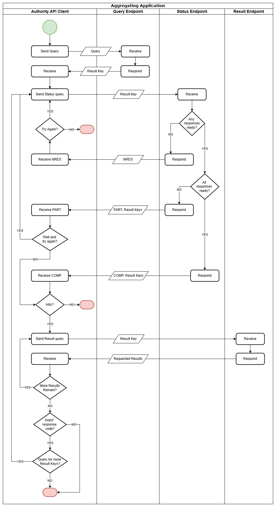

[Tiedon hyödyntäjien käyttöönoton ja ylläpidon ohje, koostava sovellus](instructions/Tiedon_hyödyntäjien_käyttöönoton_ja_ylläpidon_ohje_koostava_sovellus.pdf)  
[Koostavan sovelluksen rajapintakuvaus](index.md)  
[Deployment and maintenance instructions for data users, Aggregating Application](instructions/Deployment_and_maintenance_instructions_for_data_users_Aggregating_Application.pdf)  
[Description of the aggregating application’s query API](index_en.md)  
[Instruktioner för uppgiftsanvändare om ibruktagande och underhåll, sammanställningsprogrammet](instructions/Instruktioner_för_uppgiftsanvändare_om_ibruktagande_och_underhåll_sammanställningsprogrammet.pdf)  

# Beskrivning av sammanställningsprogrammets frågegränssnitt

*Dokumentversion 1.01*

## Versionhistorik

| Version | Datum      | Beskrivning                                                        |
|---------|------------|--------------------------------------------------------------------|
| 1.0     | 7.2.2023 | Version 1.0                                                        |
| 1.01    | x.6.2023 | Uppdaterade två nya datafält i avsnitt 4.2. Det ena används för att rikta förfrågan till angiven datakälla eller angivna datakällor, det andra för att märka att förfrågan kopplas till en internationell/gränsöverskridande information begäran. Dessutom updaterade i avsnitt 4.7 hur InvstgtnSts NOAP används i svarsmeddelandet. |

## Innehåll

1. [Inledning](#chapter1)  
2. [Förfrågan om bank- och betalkontouppgifter i sammanställningsprogrammet](#chapter2)  
3. [Datasäkerhet](#chapter3)  
4. [Sammanställningsprogrammets frågegränssnitt](#chapter4)   
  4.1 [Meddelandestruktur för frågegränssnittets SOAP-operationer](#4-1)    
  4.2 [Frågegränssnitt](#4-2)    
  4.3 [Statusgränssnitt](#4-3)    
  4.4 [Resultatgränssnitt](#4-4)    
  4.5 [Utvidgat meddelande Fin020 (QueryResultRequest)](#4-5)    
  4.6 [Utvidgat meddelande Fin021 (QueryResultResponse)](#4-6)    
  4.7 [Användning av elementet ReturnIndicator1](#4-7)    
  4.8 [Hantering av felsituationer](#4-8)    
  4.9 [Exempelmeddelanden](#4-9)    
  

## 1. Inledning 

### 1.1 Termer och förkortningar

| Förkortning eller term | Förklaring                                                                                                                                                                                               |
|------------------------|----------------------------------------------------------------------------------------------------------------------------------------------------------------------------------------------------------|
| Gränssnitt             | Standardenlig praxis eller kontaktyta som möjliggör överföring av information mellan enheter, programvaror eller användare.                                                                              |
| WS (Web Service)       | Webbaserat datorprogram som med hjälp av standardiserade internetprotokoll ställer tjänster till förfogande för applikationerna. Tjänsten som datasöksystemet tillhandahåller är förfrågan om uppgifter. |
| Endpoint               | Gränssnittstjänst som finns tillgänglig på en viss webbadress.                                                                                                                                           |
| WSDL                   | (Web Service Description Language) Strukturellt beskrivningsspråk som används för att beskriva funktioner som en webbtjänst erbjuder.                                                                    |

### 1.2 Dokumentets syfte och omfattning

Detta dokument kompletterar Tullens föreskrift om ett övervakningssystem för bank- och betalkonton. Syftet med dokumentet är att ge anvisningar om sammanställningsprogrammets frågegränssnitt. Detta dokument kompletteras av Instruktioner för ibruktagande och underhåll för uppgiftsanvändare.

### 1.3 Hänvisningar

[WSDL för datasöksystemet](https://finnishcustoms-suomentulli.github.io/account-register-information-query/wsdl/data-retrieval-system-wsdl.xml)

[fin.020.001.01](schemas/fin.020.001.01.xsd)

[fin.021.001.03](schemas/fin.021.001.03.xsd)

[fin.012.001.03](schemas/fin.012.001.03.xsd)

[Anvisning om informationssäkerheten inom elektronisk ärendehantering](http://julkaisut.valtioneuvosto.fi/bitstream/handle/10024/80012/VM_25_2017.pdf)

### 1.4 Allmän beskrivning

Tullen har inrättat ett Kontoregisterprojekt för att genomföra direktivet (EU) 2018/843 och det övervakningssystem över bank- och betalkonton som grundar sig på Finlands lagstiftning och vars syfte är att genomföra direktivet.

I detta dokument beskrivs sammanställningsprogrammets frågegränssnitt.

## 2. Förfrågan om bank- och betalkontouppgifter i sammanställningsprogrammet 

I detta kapitel beskrivs förfrågan om bank- och betalkontouppgifter i sammanställningsprogrammet.

Frågeprocessen åskådliggörs som ett flödesschema i bild 2.1.

  
*__Bild 2.1.__ Uppgiftsförfrågan i sammanställningsprogrammet*  

I tabell 2.1 redogörs för parametrarna i flödesschemat. 

*__Tabell 2.1.__ Parametrarna i flödesschemat*

| Parameter          | Beskrivning                                                                                                                                                                                                                                                                                                            |
|--------------------|------------------------------------------------------------------------------------------------------------------------------------------------------------------------------------------------------------------------------------------------------------------------------------------------------------------------|
| POLLING_INTERVAL   | Pollingintervall, ett tidsintervall som klienten måste vänta ut före följande förfrågning är 1 minut. Om klienten pollar servern för frekvent, kan servern avvisa behandlingen av transaktionen (felkod 3, se [Tabell 4.12.1](https://finnishcustoms-suomentulli.github.io/account-register-information-query/#4-12)). |
| POLLING_TIME_LIMIT | Maximal tid för pollingar, innan man slutar. Om inget svar fås, ska man göra en helt ny förfrågan eller överföra ärendet till manuell handläggning.                                                                                                                                                                    |

Förfrågningen har följande flöde:
1. Klienten skickar ett frågemeddelande till Query API.
2. Som svar returnerar Query API en nyckel (resultKey).
3. Klienten väntar en stund (se POLLING_INTERVAL) och skickar sedan en statusförfrågan med nyckeln till Status API.
4. Status API returnerar  
  a. antingen koden NRES, om svaret inte ännu är färdigt  
  b. eller koden COMP och en lista på nycklar. 
5. Om koden är NRES, går klienten tillbaka till punkt 3.
6. Om koden är COMP, skickar klienten en förfrågan på sökresultat till Result API med en av de nycklar som den mottagit i punkt 4.b.
7. Result API returnerar ett meddelande med det sökresultat som motsvarar nyckeln.
8. Om alla sökresultat inte har hämtats, återgår man till punkt 6 och upprepar sökningen med nästa nyckel.
9. Om alla sökresultat har hämtats, gå till slut.
 
Responskoderna definieras i ISO-koduppsättningen StatusResponse1Code; användningen av dem beskrivs i tabell 2.2.

*__Tabell 2.2.__ Användning av värden för StatusResponse1Code*

| Kod  |Namn|Definition|Beskrivning|
|:---|:---|:---|:---|
| COMP |CompleteResponse|Response is complete.|Svarsmeddelandet innehåller sökresultaten.|
| NRES |NoResponseYet|Response not provided yet.|Svarsmeddelandet innehåller inga sökresultat, gör en ny förfrågan senare.|
| PART |PartialResponse|Response is partially provided.|Används inte.|

#### Förvaringstid för resultaten i sammanställningsprogrammet
Resultaten raderas när de hämtas. De färdiga resultaten förvaras högst 24 timmar efter att de sammanställts och de ska hämtas under denna tid. 

##  3. Datasäkerhet

Datasäkerhetsförfarandet följer de principer som beskrivs i [beskrivning av datasöksystemets frågegränssnitt](https://finnishcustoms-suomentulli.github.io/account-register-information-query/index_sv.html#dataskydd).

##  4. Sammanställningsprogrammets frågegränssnitt

Gränssnittet genomförs med SOAP/XML Web Service, för vilken [WSDL](https://finnishcustoms-suomentulli.github.io/account-register-information-query/wsdl/data-retrieval-system-wsdl.xml) publicerats med beskrivning av datasöksystemets frågegränssnitt.

Version 1.1 av SOAP-protokollet används.

I meddelandena används hänvisningar till koduppsättningen i ISO 20022-standarden. Hänvisningarna till koduppsättningen finns på ISO 20022 sidan [External Code Sets](https://finnishcustoms-suomentulli.github.io/account-register-information-query/assets/iso20022org/ExternalCodeSets_2Q2020_August2020_v1.xlsx).

Sammanställningsprogrammets gränssnitt har följande tre endpoint: 
- [mottagning av förfrågan](#4-2)
- [förfrågan om förfrågans status](#4-3)
- [hämtning av sökresultat](#4-4)

###  4.1 Meddelandestruktur för frågegränssnittets SOAP-operationer
Den meddelandestruktur som används i gränssnittet är på huvudnivån identisk med definitionen i Tullens [frågegränssnitt för datasöksystemen](https://finnishcustoms-suomentulli.github.io/account-register-information-query/index_sv.html#fragegranssnitt).
I gränssnittet har dessutom definierats undermeddelandena [fin.020](#4-5) och [fin.021](#4-6), för förmedling av de nödvändiga koderna för kontroll av sökningens status och hämtning av sökresultaten.

###  4.2 Frågegränssnitt
Meddelandet som skickas till frågegränssnittet är för det mesta liknar meddelandet i [frågegränssnittet för datasöksystemen](https://finnishcustoms-suomentulli.github.io/account-register-information-query/index_sv.html#fragegranssnitt). Skillnaden mellan meddelandet i datasöksystemets och sammanställningsprogrammets frågegränsnitt är att fin012 utvidgat meddelande har två ytterligare datafält i sammanställningsprogrammets frågegränsnitt: RequestedDataSources och InternationalRequest. RequestedDataSources fältet används för att rikta förfrågan till ett eller flera datakällor (datasöksystem och kontoregister). Riktad förfrågan skickas bara till angivna datakällor. InternationalRequest används för att märka att förfrågan kopplas till en internationell/gränsöverskridande information begäran enligt ((EU) 2019/1153) artikel 19 och nationella lagen om penningtvätt (444/2017) 2 kap 4 §.

Svarsmeddelandet har också samma struktur, men meddelandet auth.002 innehåller undermeddelandet fin.021, som anger koden för den förfrågan som mottagits. Koden används vid kontroll av förfrågans status i [statusgränssnittet](#4-3). I statusgränsnittet returnerar de övriga undermeddelandena status NFOU, som i detta fall saknar betydelse.

####  4.2.1 Utvidgat meddelande InformationRequestFIN012

Schemat för undermeddelanden är bestämt i [fin.012](schemas/fin.012.001.03.xsd) fil. Det utvidgade meddelandet kopplas till ISO 20022-meddelandets XPath-läge som anges i tabellen.

| Namn                                             | [min..max] | Typ                                           | Beskrivning                                                                                                                             | Kopplas till meddelandet | XPath                                    |
|:-------------------------------------------------|:-----------|:-----------------------------------------------|:----------------------------------------------------------------------------------------------------------------------------------------|:-------------------|:-----------------------------------------|
| InformationRequestFIN012                         |            |                                                |                                                                                                                                         | auth.001           | `/Document/InfReqOpng/SplmtryData/Envlp` |
| &nbsp;&nbsp;&nbsp;&nbsp;AuthorityInquiry         | [1..1]     | [AuthorityInquirySet](#authority-inquiry-set)  | Myndighetsuppgifter i anknytning till förfrågan.                                                                                             |                    |
| &nbsp;&nbsp;&nbsp;&nbsp;AdditionalSearchCriteria | [0..\*]    |                                                | Används för att söka med bankfackets identifieringsuppgift.                                                                                          |                    |
| &nbsp;&nbsp;&nbsp;&nbsp;RequestedDataSources     | [0..1]     | [RequestedDataSources](#requested-datasources) | Datakällan eller datakällor som mottagar förfrågan. Om elementet saknas från meddelandet, skickas förfrågan till alla datakällor. |                    |
| &nbsp;&nbsp;&nbsp;&nbsp;InternationalRequest     | [0..1]     | boolean                                        | Värdet "true" används om förfrågan kopplas till internationell information begäran.                                                    |                    |

####  AuthorityInquirySet

| Namn                                       | Typ       | Används | Beskrivning                                         |
|:-------------------------------------------|:-----------|:-------|:----------------------------------------------------|
| AuthorityInquirySet                        |            |        |                                                     |
| &nbsp;&nbsp;&nbsp;&nbsp;OfficialId         | Max140Text | Yes    | Myndighetens (person) kod |
| &nbsp;&nbsp;&nbsp;&nbsp;OfficialSuperiorId | Max140Text | Yes    | Chefens kod               |

####  RequestedDataSources

| Namn                                    | [min..max] | Typ       | Beskrivning                         |
|:----------------------------------------|:-----------|:----------|:------------------------------------|
| RequestedDataSources                    |            |           |                                     |
| &nbsp;&nbsp;&nbsp;&nbsp;DataSourceOrgId | [1..\*]    | Max35Text | Datakällas FO-nummer |

###  4.3 Statusgränssnitt
Meddelandet som skickas till statusgränssnittet har samma innehåll som förfrågan, och den kod som fanns i svaret från frågegränssnittet skickas dessutom i undermeddelandet [fin.020 submessage](#4-5).

Svarsmeddelandet är detsamma som i svar från [frågegränssnittet](#4-2) plus följande: 
- Om förfrågan inte är slutförd, returneras statuskoden NRES i fältet RspnSts i schemat Auth.002.
- Om förfrågan är klar, returneras statuskoden COMP i fältet RspnSts i schemat Auth.002 och dessutom i undermeddelandet [fin.021](#4-6) den kod som använts i statusförfrågan och en lista på koder med vilka resultaten kan hämtas ur [resultatgränssnittet](#4-4). 

###  4.4 Resultatgränssnitt
Meddelandet som skickas till resultatgränssnittet har samma innehåll som förfrågan, och de koder som mottagits som svar från statusgränssnittet anges dessutom en i taget i undermeddelandet [fin.020](#4-5).

Svarsmeddelandet är identiskt med [svarsmeddelandet](https://finnishcustoms-suomentulli.github.io/account-register-information-query/index_sv.html#InformationRequestResponseV01) i datasöksystemets frågegränssnitt och innehåller de egentliga sökresultaten enligt schemat. I undermeddelandet [fin.021](#4-6) returneras därtill resultatets kod samt i attributet _datasourceIdentifier_ FO-numret på det datasöksystem som returnerat resultatet.

###  4.5 Utvidgat meddelande Fin020 (QueryResultRequest)
Schemat för undermeddelandet definieras i filen [fin.020](schemas/fin.020.001.01.xsd). Det utvidgade meddelandet kopplas till ISO 20022-meddelandets XPath-läge som anges i tabellen.

|Namn|[min..max]|Typ|Beskrivning|Kopplas till meddelandet|XPath|
|:---|:---|:---|:---|:---|:---|
|QueryResultRequest| | | |[auth.001](https://finnishcustoms-suomentulli.github.io/account-register-information-query/index_sv.html#InformationRequestOpeningV01)|`/Document/InfReqOpng/SplmtryData/Envlp`|
|&nbsp;&nbsp;&nbsp;&nbsp;ResultKeyList|[1..1]|ResultKeyList|Kodlista för uppgifter som söks||

###  4.6 Utvidgat meddelande Fin021 (QueryResultResponse)
Schemat för undermeddelandet definieras i filen [fin.021](schemas/fin.021.001.03.xsd). 
I likhet med de övriga undermeddelandena returneras undermeddelandet i [svarsmeddelandet från datasöksystemet](https://finnishcustoms-suomentulli.github.io/account-register-information-query/index_sv.html#InformationRequestResponseV01) i elementet [ReturnIndicator1](#4-7).

Följande data returneras som attribut för ResultKeyList-elementet:
- datasourceOrganisationId: FO-numret för datakällan
- errorCode: i händelse av fel, antingen felkoden som returneras från datakällan eller en som genereras av sammanställningsprogrammet, se [4.8 Felhantering](#4-8)

|Namn|[min..max]|Typ|Beskrivning|Kopplas till meddelandet|XPath|
|:---|:---|:---|:---|:---|:---|
|QueryResultResponse| | | |[auth.002](https://finnishcustoms-suomentulli.github.io/account-register-information-query/index_sv.html#InformationRequestResponseV01)|`/Document/InfReqRspn/RtrInd/InvstgtnRslt/Rslt`|
|&nbsp;&nbsp;&nbsp;&nbsp;QueryKeyList|[1..1]|QueryKeyList|Kodlista för förfrågningar||
|&nbsp;&nbsp;&nbsp;&nbsp;ResultKeyList|[1..1]|ResultKeyList|Kodlista för resultatdata||

| Namn                              | [min..max] | Typ        | Beskrivning         | Anteckningar                                                 |
|:----------------------------------|:-----------|:-----------|:--------------------|:-------------------------------------------------------------|
| QueryKeyList                      |            |            |                     ||     |
| &nbsp;&nbsp;&nbsp;&nbsp;ResultKey | [1..n]     | Max256Text | UUID för resultatet ||     |
| ResultKeyList                     |            |            |                     ||     |
| &nbsp;&nbsp;&nbsp;&nbsp;ResultKey | [1..n]     | Max256TextAllowedEmpty | UUID för resultatet eller tom i fall av fel| Valfria attribut: `datasourceOrganisationId` och `errorCode` |

###  4.7 Användning av elementet ReturnIndicator1

ReturnIndicator1 innehåller en enskild typ av sökresultat, precis som i [svarsmeddelandet](https://finnishcustoms-suomentulli.github.io/account-register-information-query/index_sv.html#InformationRequestResponseV01) i datasöksystemets frågegränssnitt. I likhet med de övriga undermeddelanden som returneras i förfrågan ingår fin.021 i detta element.

| XPath                       | Typ                        | Beskrivning                                                                                                                                                                                                                                |
|:----------------------------|:---------------------------|:-------------------------------------------------------------------------------------------------------------------------------------------------------------------------------------------------------------------------------------------|
| RtrInd/AuthrtyReqTp/MsgNmId | Max35Text                  | Innehåller det utvidgade meddelandets meddelande-id (fin.021.001.03))                                                                                                                                                                      |
| RtrInd/InvstgtnRslt         | InvestigationResult1Choice | Returneras elementet `Rslt` av typen SupplementaryDataEnvelope1, som innehåller ett av undermeddelandena ([fin.021](#4-6), supl.027, fin.013 eller fin.002) eller elementet `InvstgtnSts`. `InvstgtnSts` returneras med koden `NFOU`, om inga uppgifter hittas med den kod som använts i förfrågan. `InvstgtnSts` returneras med koden `NOAP` om flera träffar hittas från en aktörs data is kontoregister med namnsökning på fysisk eller juridisk person. |

###  4.8 Hantering av felsituationer
På felhantering och returnering av koder tillämpas relevanta delar av definitionerna i avsnitt [Scenarier för frågegränssnittets WS-meddelandetrafik](https://finnishcustoms-suomentulli.github.io/account-register-information-query/index_sv.html#4-12) i datasöksystemets frågegränssnitt.

Svarsmeddelandena som returneras från statusgränssnitten kan vara tom och innehålla en felkod i fall något har gått fel med förfrågan. I detta fall förfrågan har inte skickats tilla datakällor och det kommer inte att vara resultater att hämta. För närvarande "TIMEOUT" är den enda felkod som returneras i detta fall.

I svarsmeddelandena som returneras från status- och resultatgränssnitten innehåller fin021-delmeddelandet även information om ett eventuellt fel som har uppstått i en del av det enskilda datasöksystem. Denna information skickas i 'errorCode'-attributet för ResultKey-elementet.

Det är inte möjligt att söka information som gäller tid före 1 september 2020 från sammanställningsprogrammet. Sammanställningsprogrammets frågegränssnitt avvisar förfrågor var tidsintervall för sökning (InvstgtnPrd) är före det.

###  4.9 Exempelmeddelanden
Exempelmeddelanden för varje frågemeddelande med svar finns i mappen examples:
- [Frågemeddelande](examples/query1.xml) och [svar](examples/query1_response.xml)
- [Statusförfrågan](examples/status1.xml) och [svar](examples/status1_response.xml) och [felmeddelande](examples/status1_response_with_query_error.xml).
- [Resultatförfrågan](examples/result1.xml), [svar](examples/result1_response.xml) och [svar med riktad förfråga och internationell begäran](examples/query_with_requested_datasources_and_international_request.xml).
  
